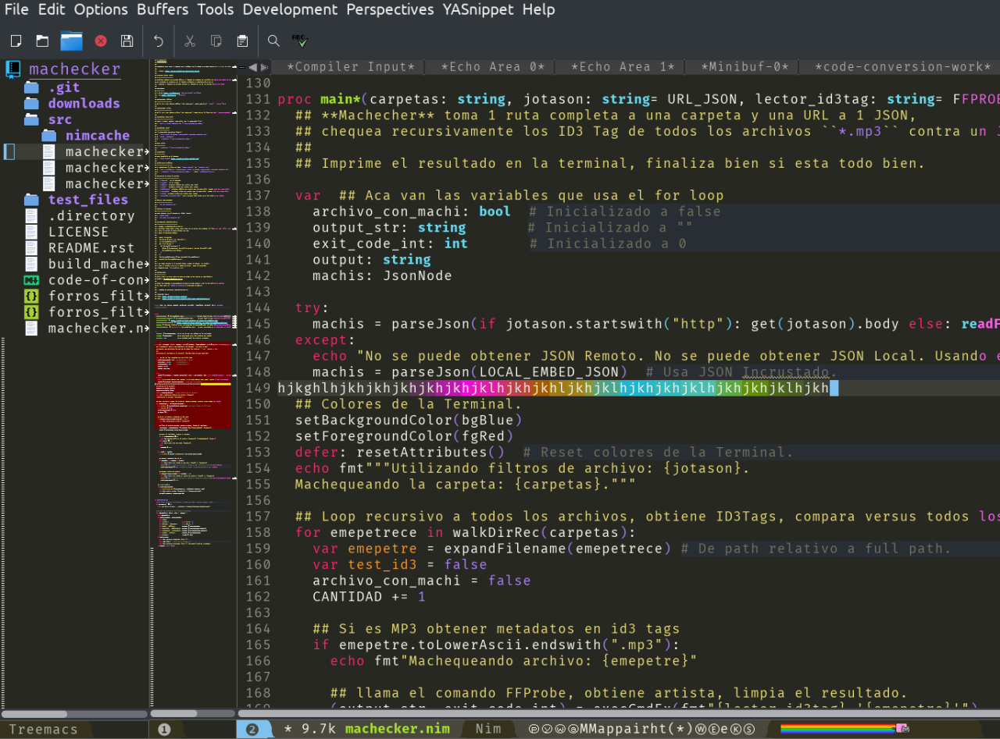
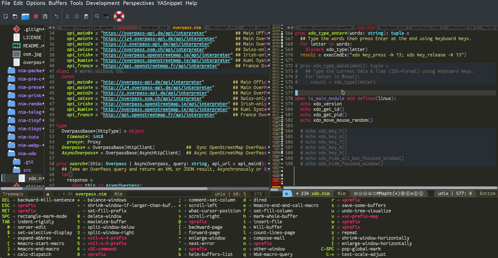

# Spacemacs-Nim-Python

http://spacemacs.org with http://python.org and https://nim-lang.org plugins, +stripped down, +eye candy.

**Atom/Sublime Look&Feel but super fast!.**







# Install

```
cd
git clone https://github.com/juancarlospaco/spacemacs-nim-python.git
rm LICENCE
rm README.md
rm nim-emacs.png
```

- It creates 1 File `~/.spacemacs` and 1 Folder `~./emacs.d/`.
- You can also install it manually downloading the file and the folder.
- The first time it requires working Internet connection to Update.
- It requires Python 3 installed.
- It requires Nim, Nimble, NimSuggest, NimGrep installed [(ChooseNim does this automatically)](https://nim-lang.org/install_unix.html).
- It uses [the Official Nim-mode.](https://github.com/nim-lang/nim-mode)
- Only tested on Linux. Pull Requests open to everyone!.
- It uses GUI, has browser-like Tabs, Folder Tree with icons, Minimap, glowing cursor, and more.
- The Screenshot is the real actual config it provides.

# Uninstall

- Delete it.


# Dependencies

- Emacs.
- Nim.


## Stars


[  ⬆️  ⬆️  ⬆️  ⬆️  ](#Spacemacs-Nim-Python "Go to top")
